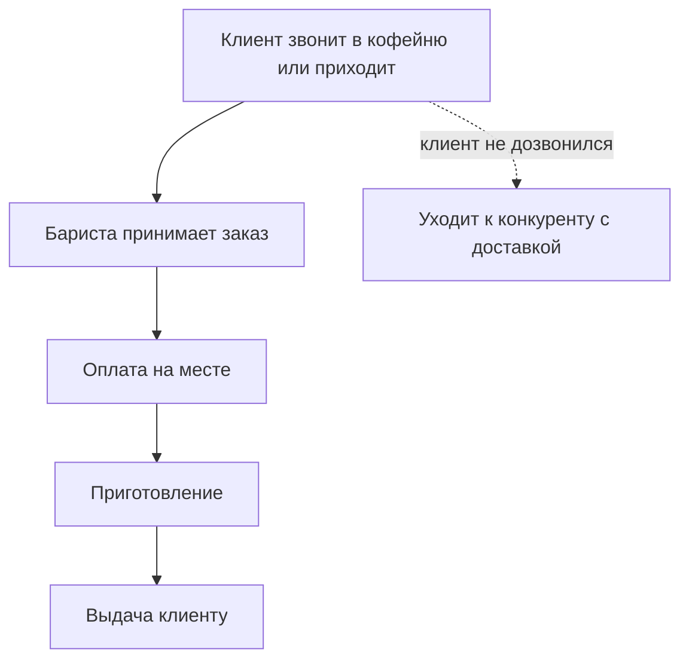
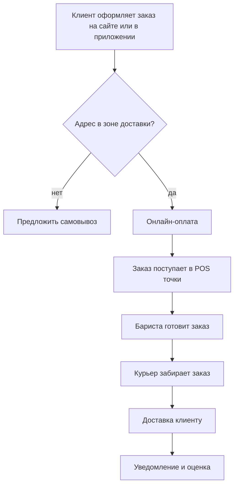

# Процесс приёма заказа: As-Is и To-Be

## As-Is (как есть)

```mermaid
flowchart TD
    A[Клиент звонит в кофейню или приходит] --> B[Бариста принимает заказ]
    B --> C[Оплата на месте]
    C --> D[Приготовление]
    D --> E[Выдача клиенту]
    A -. клиент не дозвонился .-> F[Уходит к конкуренту с доставкой]
```

## To-Be (как должно быть)

```mermaid
flowchart TD
    A[Клиент оформляет заказ на сайте или в приложении] --> B{Адрес в зоне доставки?}
    B -- нет --> C[Предложить самовывоз]
    B -- да --> D[Онлайн-оплата]
    D --> E[Заказ поступает в POS точки]
    E --> F[Бариста готовит заказ]
    F --> G[Курьер забирает заказ]
    G --> H[Доставка клиенту]
    H --> I[Уведомление и оценка]
```
