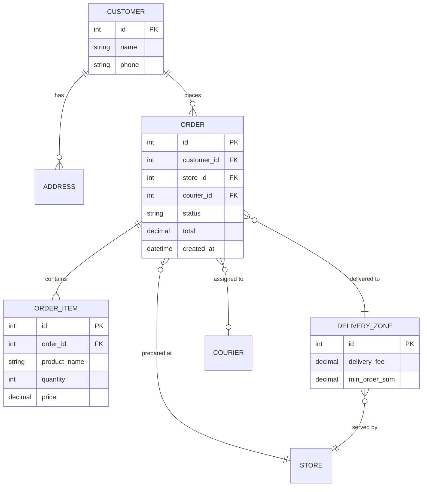

# Модель данных (ER)

```mermaid
erDiagram
    CUSTOMER ||--o{ ADDRESS : has
    CUSTOMER ||--o{ ORDER : places
    ORDER ||--|{ ORDER_ITEM : contains
    ORDER }o--|| DELIVERY_ZONE : "delivered to"
    ORDER }o--o| COURIER : "assigned to"
    ORDER }o--|| STORE : "prepared at"
    DELIVERY_ZONE }o--|| STORE : "served by"

    CUSTOMER {
        int id PK
        string name
        string phone
    }
    ORDER {
        int id PK
        int customer_id FK
        int store_id FK
        int courier_id FK
        string status
        decimal total
        datetime created_at
    }
    ORDER_ITEM {
        int id PK
        int order_id FK
        string product_name
        int quantity
        decimal price
    }
    DELIVERY_ZONE {
        int id PK
        decimal delivery_fee
        decimal min_order_sum
    }
```

**Открытый вопрос для SA:** где источник истины для меню и цен: POS или новая система.
