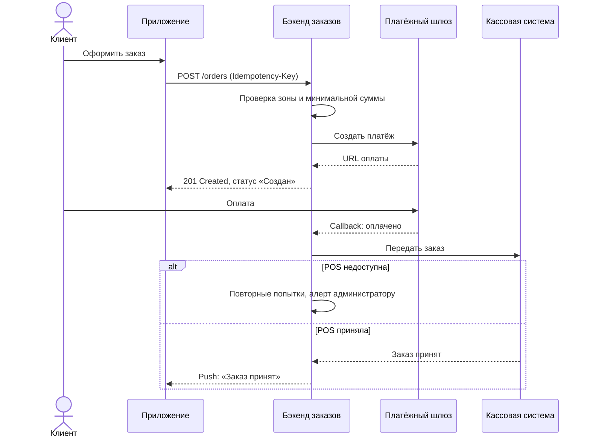

# Sequence: оформление заказа

```mermaid
sequenceDiagram
    actor C as Клиент
    participant App as Приложение
    participant API as Бэкенд заказов
    participant Pay as Платёжный шлюз
    participant POS as Кассовая система

    C->>App: Оформить заказ
    App->>API: POST /orders (Idempotency-Key)
    API->>API: Проверка зоны и минимальной суммы
    API->>Pay: Создать платёж
    Pay-->>API: URL оплаты
    API-->>App: 201 Created, статус «Создан»
    C->>Pay: Оплата
    Pay-->>API: Callback: оплачено
    API->>POS: Передать заказ
    alt POS недоступна
        API->>API: Повторные попытки, алерт администратору
    else POS приняла
        POS-->>API: Заказ принят
        API-->>App: Push: «Заказ принят»
    end
```
